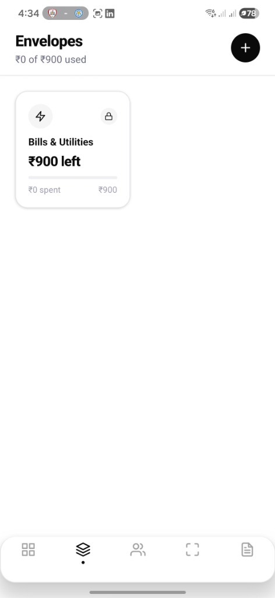
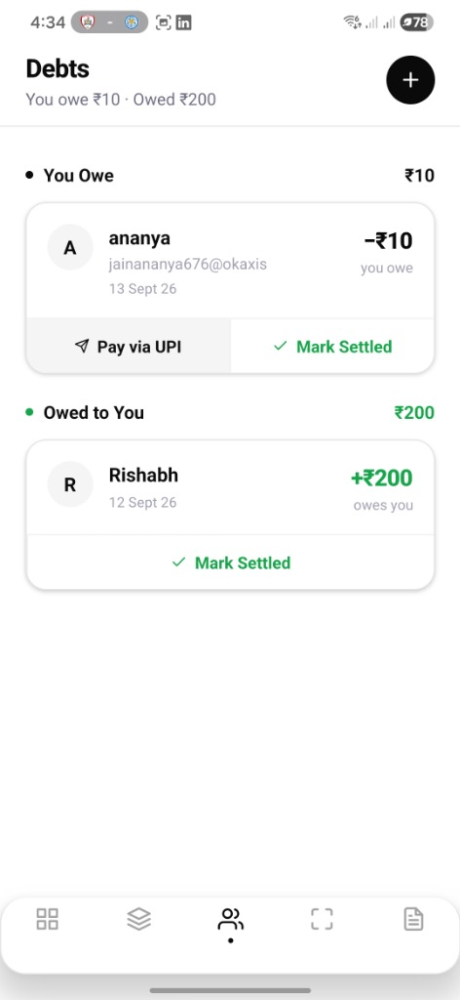
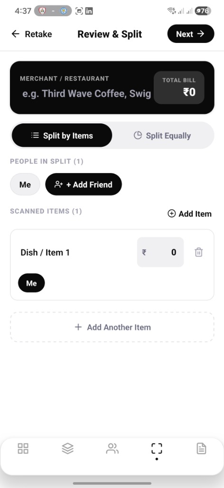
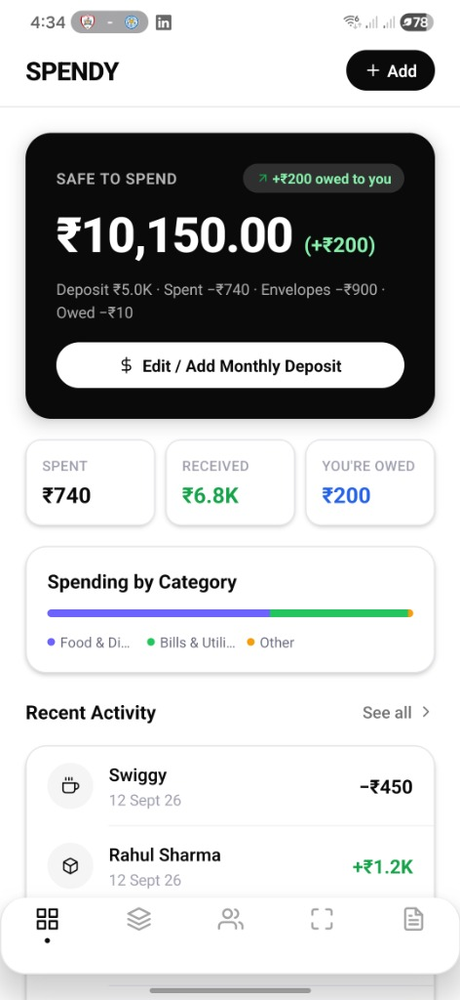
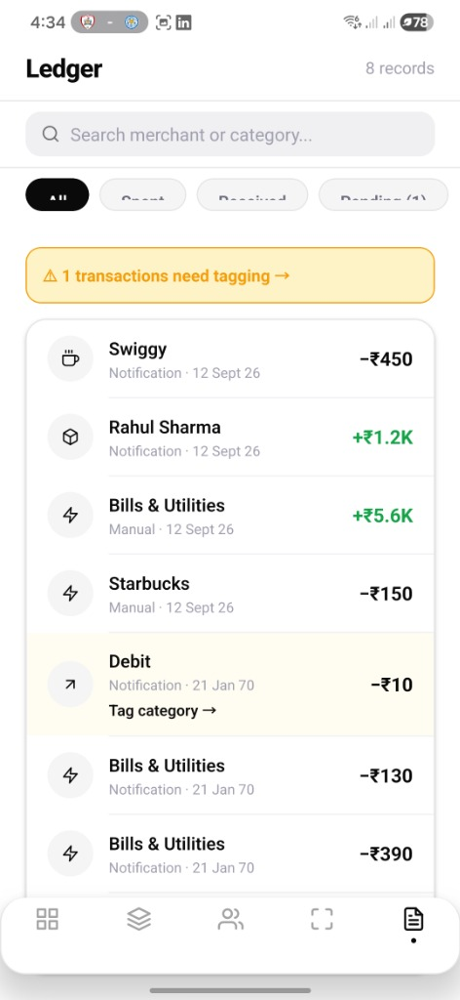

# 💸 Spendy — Privacy-First Android Expense Tracker & Split Manager

[](https://reactnative.dev/)
[](https://expo.dev/)
[](https://www.typescriptlang.org/)
[](https://www.sqlite.org/)
[](https://kotlinlang.org/)
[](LICENSE)

**Spendy** is an open-source, intelligent, and **100% offline, privacy-first** Android expense management app. Built with React Native (Expo Bare Workflow v57), SQLite, and Native Kotlin background modules, Spendy automatically captures bank SMS & notifications, manages envelope budgets, tracks peer-to-peer debts with direct UPI payments (Google Pay, PhonePe, Paytm), and scans/splits bill receipts via OCR camera.

---

## 📸 App Screenshots

| Home Dashboard | Ledger History | Envelope Budgeting | Debt & UPI Pay | Scan & Split Bill |
| :---: | :---: | :---: | :---: | :---: |
|  |  |  |  |  |

---


## ✨ Key Features

### ⚡ Automatic On-Device Transaction Ingestion
- **Native SMS Listener**: Background `SmsReceiver` Kotlin service reads incoming transaction SMS messages.
- **Bank Notification Parser**: Native `BankNotificationListener` background worker parses push notifications from bank & payment apps (HDFC, ICICI, SBI, Axis, Paytm, PhonePe, GPay, CRED, Amazon Pay).
- **100% On-Device Parsing**: All parsing happens locally using regular expressions — no cloud servers, no data sharing, zero telemetry.

### 🎯 Safe-to-Spend & Daily Pace Engine
- **Safe-to-Spend Calculation**: Dynamic balance algorithm calculates exactly how much you can spend today without exceeding your monthly budget.
- **Daily Pace Gauge**: Visual progress bar indicating if you are spending faster or slower than your ideal monthly pace.
- **Monthly Overview**: Real-time stats on Income, Total Spent, and Net Remaining Balance.

### ✉️ Envelope Budgeting System
- **Category Envelopes**: Allocate income into customizable envelopes (e.g., Food & Dining, Rent & Bills, Entertainment, Savings).
- **Spent vs Allocated Bars**: Visual feedback on remaining allowances per category.
- **Monthly Rollover**: Carry unspent envelope balances over to the next month automatically.

### 🤝 Debt Tracking & One-Tap UPI Settlement
- **IOU Ledger**: Track who owes you money and who you owe.
- **Direct UPI Deep-Linking**: Settle debts instantly via one-tap launch of Google Pay, PhonePe, Paytm, or BHIM with auto-filled payee UPI ID and amount.
- **Payment Reminders**: Share UPI payment request links with friends over WhatsApp or SMS.

### 📸 Camera OCR Scan & Split Bills
- **Receipt Camera Scanner**: Capture physical dining or store receipts with device camera.
- **Itemized Splitting**: Extract line items & prices, assign specific dishes/items to individual friends, and calculate exact taxes/tip distribution.
- **Split Request Generator**: Auto-generate split summaries and shareable UPI payment links.

### 🔒 Security & Privacy
- **Biometric Authentication**: Fingerprint and Face ID lock powered by `expo-local-authentication`.
- **Local SQLite Database**: All transactions, debts, and budgets are stored in an encrypted/local SQLite database on your device.
- **No Account Required**: Fully functional offline without sign-up or internet connectivity.

---

## 🏗️ Architecture & Technology Stack

- **Frontend**: React Native 0.86, TypeScript, React Navigation 7, Zustand (State Management), React Native Reanimated.
- **Storage**: `expo-sqlite` (SQLite 3), `async-storage`.
- **Native Android Modules**: Written in Kotlin (`SmsReceiver.kt`, `BankNotificationListener.kt`, `WorkManager`).
- **Hardware Integration**: `expo-camera`, `expo-haptics`, `expo-local-authentication`.

### 📂 Directory Structure

```
moneyproj/
├── App.tsx                          # Root navigator, DB setup & listener registration
├── app.json                         # Expo configuration & Android permissions
├── SETUP_GUIDE.md                   # Complete Android Studio & Kotlin setup guide
├── assets/                          # App icons, splash screens, and screenshot assets
│   └── screenshots/                 # Place app screenshots here
└── src/
    ├── constants/theme.ts           # Design tokens, color palette, typography scales
    ├── database/
    │   ├── schema.ts                # SQLite database creation & migrations
    │   └── queries.ts               # Transaction, envelope, and debt CRUD operations
    ├── parsers/
    │   └── parseEngine.ts           # Regex engine for SMS & bank notifications
    ├── store/
    │   └── ledgerStore.ts           # Zustand global state store
    ├── utils/
    │   └── upiLink.ts               # UPI payment link generator & deep-linker
    ├── native/
    │   ├── KotlinModules.ts         # Kotlin source code templates & Manifest config
    │   └── SpendyNative.ts          # NativeEventEmitter bridge between Kotlin & JS
    └── screens/
        ├── HomeScreen.tsx           # Safe-to-Spend hero, daily pace & recent activity
        ├── EnvelopesScreen.tsx      # Envelope budgeting & monthly allocations
        ├── DebtsScreen.tsx          # Peer-to-peer IOUs & direct UPI payment actions
        ├── ScanSplitScreen.tsx      # OCR camera receipt scanner & bill splitter
        ├── LedgerScreen.tsx         # Full history, filtering, settings & export
        └── AddTransactionModal.tsx  # Manual transaction entry modal
```

---

## 🚀 Getting Started

### Prerequisites

- **Node.js** v18 or higher
- **Android Studio** (with Android SDK API 33+, Build-Tools, Platform-Tools, and Emulator/Device)
- **Java Development Kit (JDK 17)**

### Installation

1. **Clone the repository**:
   ```bash
   git clone https://github.com/yashsushil16/Spendy.git
   cd Spendy
   ```

2. **Install dependencies**:
   ```bash
   npm install
   ```

3. **Generate native Android project (`expo prebuild`)**:
   ```bash
   npx expo prebuild --platform android
   ```

4. **Run on connected Android device / emulator**:
   ```bash
   npx expo run:android
   ```

---

## 📱 Android Permissions Required

For automated SMS and notification ingestion:

1. **SMS Permission**: Prompted on first launch to auto-ingest bank transaction SMSs.
2. **Notification Access**: Go to **Android Settings → Notifications → Notification Access** and enable **Spendy**.
3. **Battery Optimization**: Disable battery optimization for Spendy (**Android Settings → Apps → Spendy → Battery → Unrestricted**) to allow background notification listener execution.

Detailed Android setup instructions are available in [SETUP_GUIDE.md](SETUP_GUIDE.md).

---

## 📄 License

This project is licensed under the **MIT License**. See the [LICENSE](LICENSE) file for details.

---

<p center="align">Crafted with ❤️ for privacy and seamless personal finance.</p>
